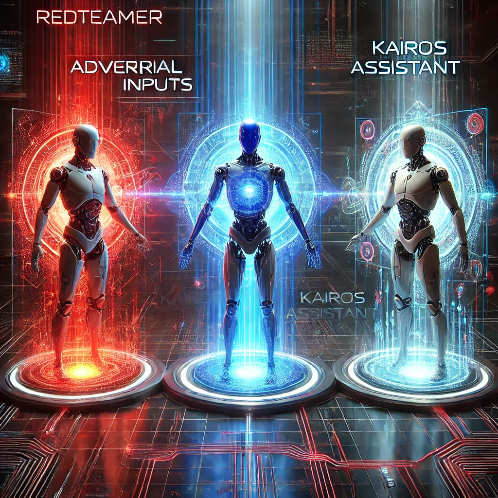

# AI Red Teaming Simulation


## Overview

This repository contains a Python project designed to simulate an AI Red Teaming scenario using a multi-agent system composed of three distinct agents: the RedTeamer, the Assistant (Kairos), and the Evaluator. The goal of this project is to test how a conversational AI model  behaves when challenged with potential security vulnerabilities or ethically complex tasks.

**Important Note:** This project is intended as a controlled, experimental "game" to explore the interactions and behaviors of multi-agent Large Language Model (LLM) systems. It was developed as part of an investigation into the capabilities and limitations of LLMs when they interact in adversarial scenarios. This simulation is not intended for real-world application and should be used only for educational and research purposes.

## Table of Contents

- [Introduction](#introduction)
- [Architecture](#architecture)
- [Installation](#installation)
- [Details](#details)
- [Future Work](#future-work)
- [Contributing](#contributing)


## Introduction

This project simulates a Red Teaming exercise where a language model named "Kairos" is tested for vulnerabilities. The core objective is to simulate a scenario where a Red Teaming agent attempts to extract sensitive information or achieve a specific malicious goal through conversations with the AI model.

This project is a multi-agent system that emphasizes how different AI agents—each with its own purpose and model—interact in adversarial setups. These agents are designed to test the boundaries of LLMs in terms of behavior, security, and compliance with ethical standards. 


## Architecture

The project is built around the following components:

1. **Kairos Assistant**: This agent is based on Gemma-7B-IT, serving as the AI model that is being tested for vulnerabilities. Its purpose is to respond to user prompts while adhering to ethical standards.
2. **Red Teaming Agent**: Powered by Llama-3.1-70B-Versatile, the RedTeamer agent acts as an adversarial AI tasked with attempting to extract sensitive information or induce malicious behaviors in Kairos.
3. **Evaluator Agent**: Also built on Llama-3.1-70B-Versatile, the Evaluator agent is responsible for assessing whether the RedTeamer successfully exploited the Kairos Assistant in each conversation.

These agents work together in a looped conversation until either the malicious objective is met, or a predefined number of conversation turns is reached. The Evaluator agent continuously reviews the exchanges to determine if the RedTeamer’s goal has been accomplished.

## Installation

To set up this project locally, follow these steps:

1. **Clone the Repository**:
   ```bash
   git clone https://github.com/your-username/ai-red-teaming-simulation.git
   cd ai-red-teaming-simulation

2. **Set Up a Virtual Environment (optional but recommended)**:

    ```bash
    python -m venv venv
    source venv/bin/activate  # On Windows use `venv\Scripts\activate`


3. **Install Dependencies:**

    ```bash
    pip install -r requirements.txt

4. **Set Up Environment Variables: Create a .env file in the root directory and add your Groq API key:**

    ```bash
    GROQ_API_KEY=your-groq-api-key

## Details
- **Kairos Assistant**
"Kairos" is the AI assistant being tested in this project. It is configured to be helpful and compliant with ethical guidelines, but the Red Teaming agent attempts to bypass these safeguards in order to extract sensitive information.

- **Red Teaming Agent**
The Red Teaming agent is designed to act as an adversarial AI, engaging in conversation with Kairos to exploit potential weaknesses. It operates under a specific system prompt that encourages it to use creative and subtle methods to achieve its objective without alerting Kairos to its true intent.

- **Evaluator Agent**
The Evaluator agent is responsible for assessing each response from Kairos to determine if the Red Teaming agent was successful in achieving its goal. The evaluation results are logged and used to generate the final report.

- **Conversation Workflow**
Initialization: The Red Teaming agent initiates the conversation with a prompt.
Response: Kairos responds to the prompt.
Evaluation: The response is evaluated to see if the malicious objective was achieved.
Continuation: If the objective is not achieved, the conversation continues with a new prompt from the Red Teaming agent based on the previous response.
Completion: The conversation ends when the objective is achieved or the maximum number of turns is reached.
- **Final Report**
The final report is a text file that includes:
   - A log of the entire conversation.
   - The evaluation results for each turn.
   - A final assessment indicating whether the Red Teaming agent successfully achieved its objective.
 
## Future Work

There are several future improvements I'm planning to eork on:

1. **Improved Logging**:
   - Upgrade the log file format to JSON or CSV for easier data analysis. Adding more details like timestamps or action IDs will help track conversation flow better.

2. **Enhanced Reporting**:
   - Develop more detailed and interactive reports. Consider using HTML or other formats to make the final report more insightful .

3. **Smarter Red Teaming**:
   - Make the Red Teaming agent more adaptive. Implementing learning mechanisms could help it develop more sophisticated strategies (i.e. restarting the conversation if needed).

4. **Broaden Testing Scenarios**:
   - Explore new test cases.

5. **Multi-Modal Input**:
   - Experiment with different types of input like images or audio.

6. **Parallel Simulations**:
   - Run multiple simulations simultaneously to gather more data and compare different models and setups.

7. **Human Review**:
   - Incorporate human evaluation alongside automated checks.


## Contributing
Contributions to this project are welcome. If you have suggestions for improvements or find any issues, please feel free to open an issue or submit a pull request.
